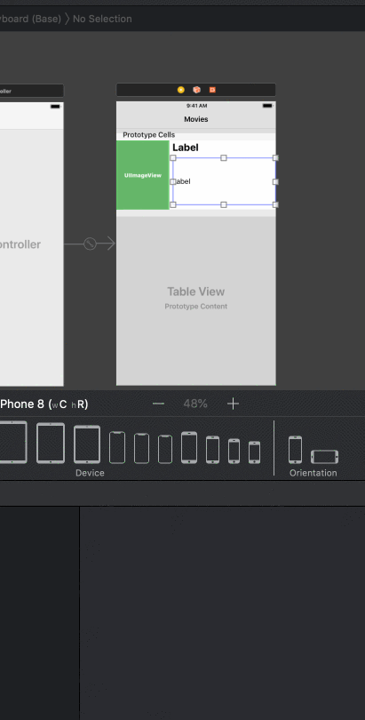
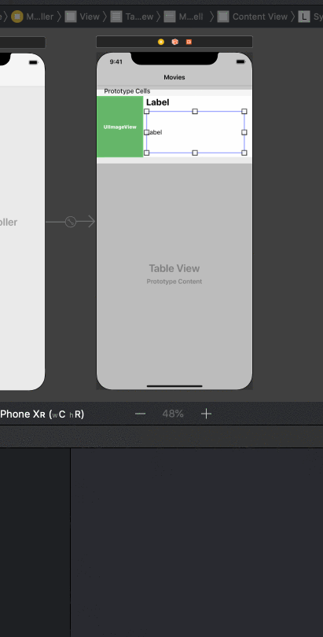
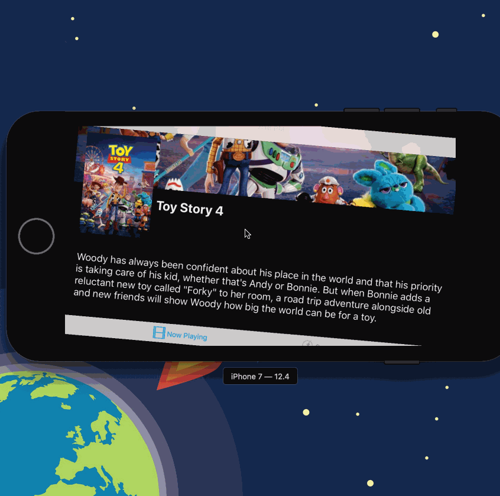
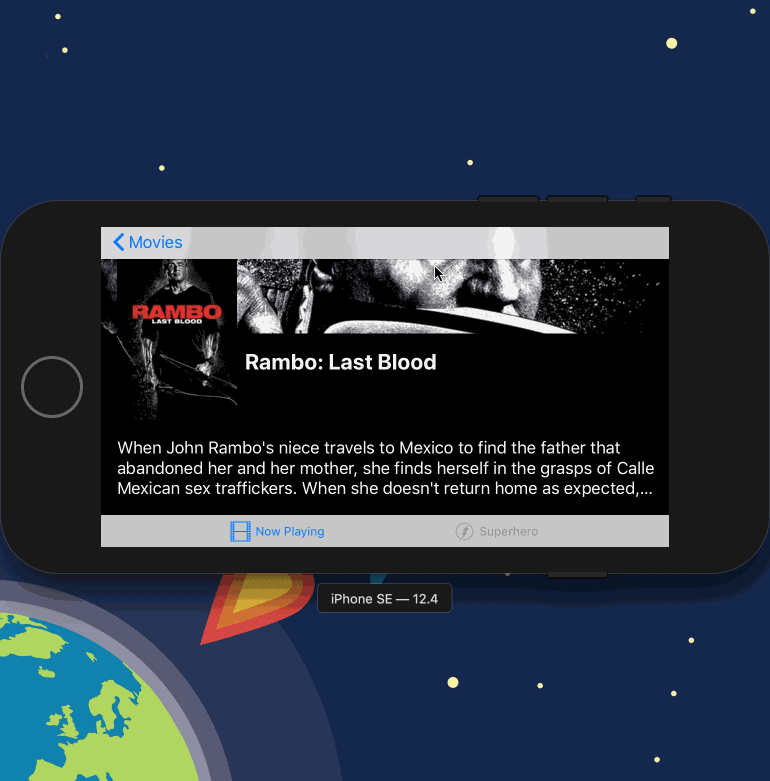

# Flix

Flix is an app that allows users to browse movies from the [The Movie Database API](http://docs.themoviedb.apiary.io/#).

## Flix Part 2

### User Stories

#### REQUIRED (10pts)
- [x] (5pts) User can tap a cell to see more details about a particular movie.
- [x] (5pts) User can tap a tab bar button to view a grid layout of Movie Posters using a CollectionView.

#### BONUS
- [ ] (2pts) User can tap a poster in the collection view to see a detail screen of that movie.
- [ ] (2pts) In the detail view, when the user taps the poster, a new screen is presented modally where they can view the trailer.

### App Walkthough GIF
 

### Notes
Describe any challenges encountered while building the app.
- Having collective views and arranging the custom cells for the collection view was a bit challenging.

---

## Flix Part 1

### User Stories

#### REQUIRED (10pts)
- [x] (2pts) User sees an app icon on the home screen and a styled launch screen.
- [x] (5pts) User can view and scroll through a list of movies now playing in theaters.
- [x] (3pts) User can view the movie poster image for each movie.

#### BONUS
- [x] (2pt) User can view the app on various device sizes and orientations.
- [ ] (1pt) Run your app on a real device.

### App Walkthough GIF

##### iPhone 8
 
##### iPhone XR
 

### Notes
Describe any challenges encountered while building the app.
- I didn't face any particular challenges. 

# Lab 3 - *Flix (Auto Layout)*

**Juhi's Auto layout Flix** is a movies app displaying box office and top rental DVDs using [The Movie Database API](http://docs.themoviedb.apiary.io/#).

Time spent: **3** hours spent in total

## User Stories

The following **required** user stories are complete:

- The following screens use AutoLayout to adapt to various orientations and screen sizes
- [ x ] Movie feed view (+3pt)
- [ x ] Detail view (+2pt)

The following **stretch** user stories are implemented:

- [ ] Dynamic Height Cells (+1)
- [ ] Collection View AutoLayout (+2)

The following **additional** user stories are implemented:

- [ ] List anything else that you can get done to improve the app functionality! (+1-3pts)

Please list two areas of the assignment you'd like to **discuss further with your peers** during the next class (examples include better ways to implement something, how to extend your app in certain ways, etc):

1. When to set height / width constraints?
2. How to set constraints for multiple views?

## Video Walkthrough

Here's a walkthrough of implemented user stories:

### iPhone 7

### iPhone SE

GIF created with [LiceCap](http://www.cockos.com/licecap/).

## Notes

Describe any challenges encountered while building the app.

## License

Copyright [Juhi Park] [name of copyright owner]

Licensed under the Apache License, Version 2.0 (the "License");
you may not use this file except in compliance with the License.
You may obtain a copy of the License at

http://www.apache.org/licenses/LICENSE-2.0

Unless required by applicable law or agreed to in writing, software
distributed under the License is distributed on an "AS IS" BASIS,
WITHOUT WARRANTIES OR CONDITIONS OF ANY KIND, either express or implied.
See the License for the specific language governing permissions and
limitations under the License.
